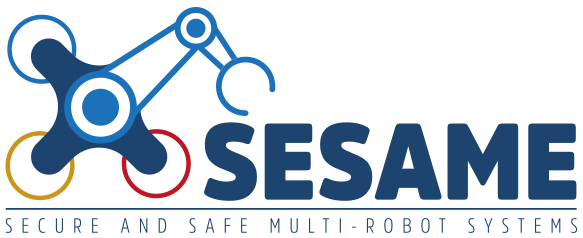

# bdd-dsl

This repository provides tooling to support the specification and execution of acceptance tests for
robotic scenarios using the [Behaviour-Driven Development (BDD)](https://dannorth.net/introducing-bdd/)
methodology. Further documentation can be found below and on the
[maintained GitHub page for the repository](https://secorolab.github.io/bdd-dsl/).

## Quick start

### Installation

1. Install [rdf-utils](https://github.com/secorolab/rdf-utils/)
1. Install `bdd-dsl` with `pip install`

### Gherkin generation & mockup execution with `behave`

A mockup test execution setup with [`behave`](https://behave.readthedocs.io/en/latest/) is available
for trying out our models. To run this setup:

1. Generate the Gherkin feature using the [`generate_bdd_specs.py`](./examples/generate_bdd_specs.py)
   script. This should create a `*.feature` file under the `examples/generated` directory.
2. Execute `behave` under `examples/generated` should run the mockup setup.

An execution setup with [Nvidia Isaac Sim](https://docs.isaacsim.omniverse.nvidia.com/latest/index.html)
is available at the [`minhnh/bdd-isaacsim-exec`](https://github.com/minhnh/bdd-isaacsim-exec) repository.

## Tutorials

1. [Concepts and relations for specifying robotic scenarios](docs/bdd-concepts.md)
2. [Tutorial: Generating Gherkin features for a simple pickup task](docs/bdd-tutorial-feature-gen.md)

## Acknowledgement

This work is partly funded by the [SESAME H2020 project](https://www.sesame-project.org/)
under grant agreement No 101017258.

    
    

