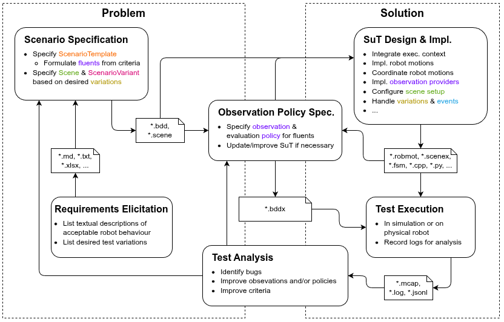

# Acceptance Testing Tutorial 1: Scenarios and Variations

This tutorial turns a free-form pick-and-place requirement into a reusable
[RobBDD](https://github.com/minhnh/robbdd) scenario template and one concrete
test variant. The complete models live in the
[robbdd_tutorials repository](https://github.com/minhnh/robbdd_tutorials),
beside the runnable ROS 2 example.

The result is a validated test specification. The
[next tutorial](at-tutorial-execution.md) adds evidence, evaluation policies,
and execution.

## The end-to-end test workflow

_The acceptance-test workflow and its feedback loops._

This tutorial covers the problem-side path from **Requirements Elicitation** to **Scenario Specification**.
Its outputs are the simulator-independent `.bdd` and `.scene` models.
[Tutorial 2](at-tutorial-execution.md) continues with **Observation Policy Specification**,
connects the models to a concrete system under test, and executes the test.
**Test Analysis** can then refine the requirements, criteria, observations, or implementation instead of
treating a test verdict as the end of the process.

## 1. Requirements Elicitation

We start with a typical robotic object-transport task. Its textual requirement might be:

> The robot shall move one object from a designated area on a table into a designated container.

Acceptable object-transport behavior may include the following criteria:

1. The target object is present in the table pick area before picking begins.
2. The requested behavior completes without error.
3. The object is not dropped while being transported from the table to the container.
4. The object is inside the container after placing completes.

### Describe desired test variations

To assess the robustness and reliability of the behavior, a standard practice is testing
across relevant variations of the setup. Typical object-transport variations include:

- different target objects;
- different source and destination workspaces, including transport from the
  container back to the table; and
- different manipulators.

## 2. Scenario Specification with RobBDD

Now translate the textual requirements into a RobBDD scenario template.

### Start with the behavior

Begin with a minimal template containing the behavior, its variables, and its boundary events.
The scenario itself spans `scenario-start` to `scenario-end`; the behavior spans `E_PICK_START` to `E_PLACE_END`.

~~~text
ns tutorial = "https://secorolab.github.io/robbdd/tutorials/pick-place/"
ns pp = "https://secorolab.github.io/models/pick-place-single/fsm/"

Task (ns=tutorial) pick-place-task

Event (ns=tutorial) scenario-start
Event (ns=tutorial) scenario-end
Event (ns=pp) E_PICK_START
Event (ns=pp) E_PLACE_END

Scenario Template (ns=tutorial) pick-place-template {
    duration: from <scenario-start> until <scenario-end>
    task: <pick-place-task>

    var robot
    var target-object
    var place-workspace

    When:
        Behaviour (ns=tutorial) pick-place-behavior {
            duration: from <E_PICK_START> until <E_PLACE_END>
            <robot> picks <target-object> and places at <place-workspace>
        }
}
~~~

At this stage, the template describes what the robot does but does not yet encode the acceptance criteria.

### Map the criteria to fluent clauses

A fluent clause combines a predicate with the interval over which it must hold.
Criteria 1, 3, and 4 become `Given` and `Then` fluent clauses.
Criterion 2 is instead established by the successful result of the behavior action, as
described in [Tutorial 2](at-tutorial-execution.md).

Add the intermediate pick/place events, the pick-workspace variable, and the three fluent clauses:

~~~diff
+++ pick_place.bdd
@@
 Event (ns=pp) E_PICK_START
+Event (ns=pp) E_PICK_END
+Event (ns=pp) E_PLACE_START
 Event (ns=pp) E_PLACE_END
@@
     var robot
     var target-object
+    var pick-workspace
     var place-workspace

+    Given:
+        object-at-pick: holds(
+            <target-object> is located at <pick-workspace>,
+            before <E_PICK_START>
+        )
+
     When:
         Behaviour (ns=tutorial) pick-place-behavior {
             duration: from <E_PICK_START> until <E_PLACE_END>
             <robot> picks <target-object> and places at <place-workspace>
         }
+
+    Then:
+        (
+            object-held: holds(
+                pred(
+                    '"{rob}" does not drop "{obj}"',
+                    rob=<robot>, obj=<target-object>
+                ),
+                from <E_PICK_END> until <E_PLACE_START>
+            )
+            and
+            object-at-place: holds(
+                <target-object> is located at <place-workspace>,
+                after <E_PLACE_END>
+            )
+        )
 }
~~~

`object-at-pick` and `object-at-place` use the built-in location relation.
`object-held` uses `pred(...)`, which maps arguments in a generic predicate
string to the corresponding scenario variables.
Together, the event-based time constraints define when each criterion
should be evaluated:

~~~text
E_PICK_START -> E_PICK_END -> E_PLACE_START -> E_PLACE_END
~~~

See the
[complete BDD model](https://github.com/minhnh/robbdd_tutorials/blob/main/robbdd_tutorials/models/pick_place/common/pick_place.bdd).

## 3. Describe the scene

The scene defines the abstract entities that variations may bind, independent of an execution context,
e.g. in simulation or on a physical robot:

~~~text
obj set (ns=pps_env) pickplace_objects {
    object cube,
    object can,
    object cereal-box,
    object bottle
}

obj set (ns=pps_env) ws_objects {
    object table,
    object container
}

ws set (ns=pps_env) pickplace_workspaces {
    workspace table-workspace,
    workspace container-workspace
}

agn set (ns=pps_agn) pickplace_agents {
    agent arm1,
    agent gripper1
}

comp (ns=pps_env) container-composition
    of ws <pickplace_workspaces.container-workspace>
{
    obj <ws_objects.container>
}

comp (ns=pps_env) table-composition
    of ws <pickplace_workspaces.table-workspace>
{
    obj <ws_objects.table>
    ws comp <container-composition>
}

scene (ns=pps_scene) pick_place_scene {
    obj set <pickplace_objects>
    ws comp <table-composition>
    agn set <pickplace_agents>
}
~~~

Workspace compositions describe abstract relationships between workspaces.
In the scene above, the container workspace is associated with the table
workspace to represent that the container sits on the table.
This association allows a robot behavior expressed relative to one workspace to be related to the other.
For example, approaching the table can also be understood as approaching the container, and vice versa.

See the
[complete Scene model](https://github.com/minhnh/robbdd_tutorials/blob/main/robbdd_tutorials/models/pick_place/common/pick_place_single.scene).

## 4. Bind a scenario variant

A table variation binds every template variable to an entity from the scene:

~~~text
Scenario nominal-pick-place {
    template: <pick-place-template>
    scene: <pick_place_scene>

    variation:
    | <pick-place-template.target-object> | <pick-place-template.pick-workspace> | <pick-place-template.place-workspace> | <pick-place-template.robot> |
    |---|
    | <pickplace_objects.cube> | <pickplace_workspaces.table-workspace> | <pickplace_workspaces.container-workspace> | <pickplace_agents.arm1> |
}
~~~

The template describes what must hold. The variant chooses which robot, object,
and workspaces participate in this run. For more expressive variation syntax,
including Cartesian products of candidate values, see
[Cartesian product variation](robbdd.md#cartesian-product-variation) in the
[RobBDD Specification Tutorial](robbdd.md).

## Validate the models

From the common model directory:

~~~bash
textx check pick_place_single.scene
textx check pick_place.bdd
~~~

Both commands must report **OK**.

Continue with:

- [Acceptance Testing Tutorial 2: Observations and Execution](at-tutorial-execution.md)
- [Acceptance Testing Tutorial 3: Set Quantifiers and Sorting](at-tutorial-sorting.md)
