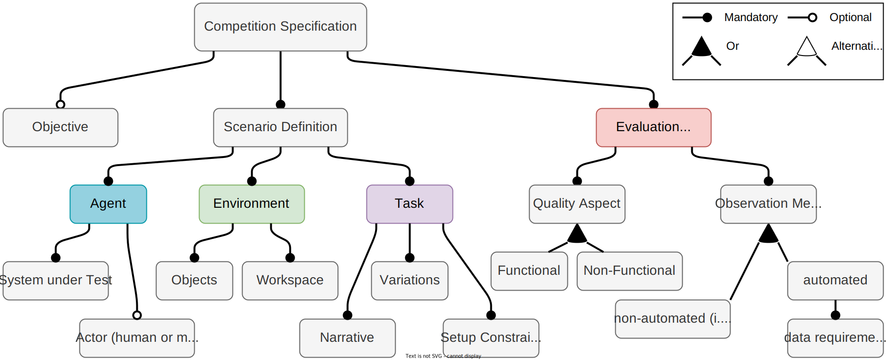

# Metamodels for Specifying BDD Scenarios for Robotic Applications

## Metamodel Design

### Quick Review of Behaviour-Driven Development (BDD)

Requirements in Test-Driven Development (TDD) are often represented using _User Stories_,
typically in the following format:

```
As a [Stakeholder role]
I want [Feature]
So that [Benefit]
```

In his original blog post[^north2003bdd] introducing BDD, North proposed to represent acceptance criteria for each user story as a list of scenarios capturing the expected behaviours of the system,
each using the following formulation:

``` Gherkin
Given [Precondition]
When [Event]
Then [Expected Outcome]
```

### Specifying Robotic Scenarios

A challenge of applying BDD to any complex domains is to deal with the myriad variations that may
exist for the same scenario. Alferez et al.[^alferez2019] proposed to define scenario templates for
common system behaviours, e.g. in their use case for operations on different data structures.
Concrete BDD scenarios can then be generated from these templates depending on the particular data
object being tested.

||
|:-:|
|Figure 1: A Feature Model of Robotic Competitions|

We aim to apply a similar idea for representing robotic scenarios, whose variability dimensions can
be vastly more numerous and complex compared to the application investigated by
Alferez et al.[^alferez2019]. To this end, we analysed rulebooks from several robotic benchmarks
and competitions[^nguyen2023rulebook] to identify common elements used to describe test scenarios
at these events. We consolidate our findings is a
[Feature Model](https://en.wikipedia.org/wiki/Feature_model), shown in Figure 1.
This serves as the basis for the metamodels described below.

## Metamodel Description

We choose to represent our metamodels and models for specifying BDD scenarios with the
[JSON-LD Schema](https://json-ld.org/). The metamodels described below can be found in the
following files:

| File | Description |
|:---|:---|
| [agent.json](https://hbrs-sesame.github.io/metamodels/agent.json) | Metamodel for specifying agents in a scenario |
| [environment.json](https://hbrs-sesame.github.io/metamodels/environment.json) | Metamodel for specifying elements in the environment of a robotic scenario |
| [task.json](https://hbrs-sesame.github.io/metamodels/task.json) | Metamodel for specifying task-related concepts and relations in a robotic scenario |
| [event.json](https://hbrs-sesame.github.io/metamodels/coordination/event.json) | Metamodel for specifying event-driven coordination of robot behaviours |
| [bdd.json](https://hbrs-sesame.github.io/metamodels/acceptance-criteria/bdd.json) | Metamodel for specifying BDD templates and their variants |

For an overview of main JSON-LD keywords used in our models, please take a look at our
[modelling tutorial](https://github.com/comp-rob2b/modelling-tutorial#json-ld). More details on
this standard can be found on the [official online documentation](https://www.w3.org/TR/json-ld/).
For brevity, we use [compact IRIs](https://www.w3.org/TR/json-ld/#compact-iris) (i.e. use `:` to
separate prefix and suffix) when referring to metamodels concepts and relations below.

| Prefix | Namespace IRI |
|:-|:-|
| `agn` | `https://hbrs-sesame.github.io/metamodels/agent#` |
| `env` | `https://hbrs-sesame.github.io/metamodels/environment#` |
| `task` | `https://hbrs-sesame.github.io/metamodels/task#` |
| `evt` | `https://hbrs-sesame.github.io/metamodels/coordination/event#` |
| `bdd` | `https://hbrs-sesame.github.io/metamodels/acceptance-criteria/bdd#` |

### Agent

- `agn:Agent`: many definitions exist for agents in autonomous systems, we adopt the definition
  from IEEE Std 1872-2015[^ieeestd1872] (cf. [prov:Agent](https://www.w3.org/TR/prov-o/#Agent),
  which focuses on the role of an agent in data provenance):
  > Something or someone that can act on its own and produce changes in the world.
- `agn:of-agent`: composition relation with a `agn:Agent` instance
- `agn:has-agent`: aggregation relation with a `agn:Agent` instance

### Environment

- `env:Object`: Physical objects in the environment which an agent may interact with. Note that
  instances of `env:Object` are not limited to objects that the agent can move around like
  bottles or cups, but can also include typically stationary objects like tables or sofas.
- `env:Workspace`: Abstract space in which an agent may operate. Instances can be areas surrounding
  objects like tables or kitchen counters, or rooms in a flat. A `env:Workspace` instance may
  contain other instances, e.g. a living room can contain a workspace surrounding the coffee table.
- `env:has-object`, `env:has-workspace` represents aggregation relation to objects and workspaces
- `env:of-object` represents composition relation to an object, e.g. a property of an object

### Task

- `task:Variation`: possible variations of a scenario. A `task:Variation` can be linked to a
  `bdd:ScenarioVariable`, which case it
- `task:can-be`: represents an aggregation relation from a `task:Variation` instance to the
  possible entities of the variation.

### Coordination

- `evt:Event`: a time instant, conforms with
  [time:Instant](https://www.w3.org/TR/owl-time/#time:Instant) from the Time Ontology in OWL
  (cf. [prov:InstantaneousEvent](https://www.w3.org/TR/prov-o/#InstantaneousEvent))

### BDD Scenario Templates and Variants

- `bdd:Scenario`
- `bdd:ScenarioVariable`

## References

[^north2003bdd]: [D. North, "Behavior Modification: The evolution of behaviour-driven development", _Better Software_, 2006.](https://dannorth.net/introducing-bdd/)

[^nguyen2023rulebook]: M. Nguyen, N. Hochgeschwender, S. Wrede, "An analysis of behaviour-driven requirement specification for robotic competitions", [_5th International Workshop on Robotics Software Engineering (RoSE’23)_](https://rose-workshops.github.io/rose2023/), May 2023.

[^alferez2019]: M. Alferez, F. Pastore, M. Sabetzadeh, et al., "Bridging the Gap between Requirements Modeling and Behavior-Driven Development," _22nd MODELS_, 2019, doi: [10.1109/MODELS.2019.00008](https://doi.org/10.1109/MODELS.2019.00008).

[^ieeestd1872] "IEEE Standard Ontologies for Robotics and Automation," in IEEE Std 1872-2015 , vol., no., pp.1-60, 10 April 2015, doi: [10.1109/IEEESTD.2015.7084073](https://doi.org/10.1109/IEEESTD.2015.7084073).
