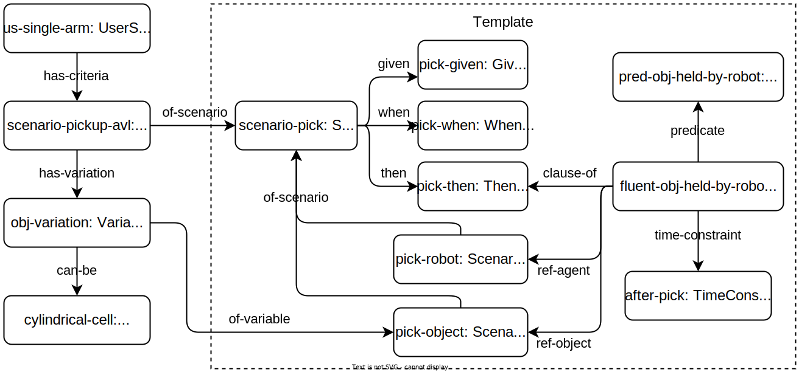

# Tutorial: Modelling and Generating Gherkin features for A Simple Pickup task

This tutorial will first showcase how [concepts from our metamodels](bdd-concepts.md) can be used
to model acceptance criteria of a simple pickup task as Behaviour-Driven Development (BDD)
scenarios, as well as how variations of such scenarios can be introduced in the model. An example
is then presented to show how to transform this model into a
[Gherkin](https://cucumber.io/docs/gherkin/reference/) feature for integration with appropriate
BDD toolchains, e.g. `behave`[^behave] for the Python language.

## Example: BDD Scenario for a Robotic Pickup Task

Consider a simple robotic pickup task, where a robot must pick an object from a surface.
A typical BDD scenario for such a task, when realized in the Gherkin format, may look
something as follows:

```gherkin
Scenario: pickup scenario
  Given an object is located on the table
  When the robot starts picking
  Then the object is held by the robot
```

In robotics, even such a simple task can vary in many dimensions: the objects to be picked up,
the operational space in which the task take place, the robotic systems that carry out the task,
or the mechanisms available for verifying the different BDD clauses. While some mechanisms are
available in Gherkin to deal with variations of scenarios, applying existing BDD approaches
like Gherkin directly to robotic scenarios remains challenging. These challenges are discussed
in more details in our workshop paper [^nguyen2023rulebook]. The rest of this tutorial
will present the process of composing a scenario template for such a pickup task, as well as
how to introduce variations to the template for concrete scenarios. Finally, we will show
how Gherkin feature files similar to the snippet above can be generated from the
scenario variant model using our library.

## Specifying BDD Acceptance Criteria for A Pickup Task

|  |
|:-:|
| Figure 1: Partial example of a BDD scenario template and variant for the pickup task. |

As mentioned in the [description of our metamodels](bdd-concepts.md), our models are graphs
represented using the JSON-LD schema. Figure 1 shows part of such a graph, which consists of
a BDD scenario template and corresponding variants for a simple pickup task. The motivation for
this template-variant design is discussed in more details on
[the documentation of our metamodels](bdd-concepts.md). Complete JSON-LD models for the scenario
[template](https://hbrs-sesame.github.io/models/acceptance-criteria/bdd/templates/pickup.json)
and [variant](https://hbrs-sesame.github.io/models/acceptance-criteria/bdd/pickup-variants.json),
along with their generated [visualization](assets/img/bdd_graph.svg) are publicly available
for download. The rest of this section will walk through the process of composing these models
from our metamodels.

### Specifying Scenario Templates

First, we define the skeleton of the BDD scenario for the pickup task: a `bdd:Scenario` having
composition relation to exactly one instance of `bdd:GivenClause`, `bdd:WhenClause`, and
`bdd:ThenClause`.

```json
{ "@id": "pick-given", "@type": "bdd:GivenClause" },
{ "@id": "pick-when", "@type": "bdd:WhenClause" },
{ "@id": "pick-then", "@type": "bdd:ThenClause" },
{
    "@id": "scenario-pick", "@type": "bdd:Scenario",
    "bdd:given": "pick-given",
    "bdd:when": "pick-when",
    "bdd:then": "pick-then"
}
```

Next, we define `bdd:ScenarioVariable` instances, which are points of variation of the
scenario template. Here, we may change the object, workspace, and agent in different variants of
the pickup scenario.

```json
{
    "@id": "pick-object", "@type": "bdd:ScenarioVariable",
    "bdd:of-scenario": [ "scenario-pick" ]
},
{
    "@id": "pick-workspace", "@type": "bdd:ScenarioVariable",
    "bdd:of-scenario": [ "scenario-pick" ]
},
{
    "@id": "pick-robot", "@type": "bdd:ScenarioVariable",
    "bdd:of-scenario": [ "scenario-pick" ]
}
```

Having defined the variables, we can now create `bdd:FluentClause` instances and attach them to
`pick-given` and `pick-then` using the `bdd:clause-of` relation to extend `scenario-pick`
with concrete clauses. Here, we have made a choice to represent BDD clauses as
[fluents](https://en.wikipedia.org/wiki/Fluent_(artificial_intelligence)),
i.e. time-dependent predicates. The composable design allows us to make this choice without
limiting our metamodel to this single representation. Other representations of BDD clauses
can still be attached to `pick-given` and `pick-then` using the `bdd:clause-of` relation.
More details on composable design can be found on the corresponding discussion on our
[kinematic chain modelling tutorial](https://github.com/comp-rob2b/modelling-tutorial).
Furthermore, the `bdd:clause-of` relation can be used to attach any clauses to
`pick-given` and `pick-then`, allowing extending `scenario-pick` with any number of
use-case specific clauses.

```json
{ "@id": "pred-obj-held-by-robot", "@type": "bdd:IsHeldPredicate" },
{ "@id": "after-pick", "@type": "bdd:TimeConstraint" },
{
    "@id": "fluent-obj-held-by-robot",
    "@type": "bdd:FluentClause",
    "bdd:clause-of": [ "pick-then" ],
    "bdd:predicate": "pred-obj-held-by-robot",
    "bdd:time-constraint": "after-pick",
    "bdd:ref-object": "pick-object",
    "bdd:ref-agent": "pick-robot"
}
```

In the example above, we define `fluent-obj-held-by-robot`, which asserts that the object is held
by the robot at the end of the picking behaviour. This `bdd:FluentClause` instance is a
composition linking to several elements in the template:

- Predicate `pred-obj-held-by-robot` is an instance of the domain-specific `bdd:IsHeldPredicate`
  concept for representing the fact that a robot is holding an object.
- Instances of `bdd:ScenarioVariable`, namely `pick-object` and `pick-robot`, which are subjects
  of `pred-obj-held-by-robot` in this context.
- Instance `after-pick` of type `bdd:TimeConstraint` which represents _when_
  `pred-obj-held-by-robot` should hold true.

The use of `bdd:IsHeldPredicate` implies a constraint that the subjects of `pred-obj-held-by-robot`
must represent objects and agents in the scenario. Here, the use of `bdd:ref-object` and
`bdd:ref-agent` indicates that `pick-object` is the object and `pick-robot` is the agent in
this context.

Additionally, the model at this point contains no assumption about how the fact that a robot is
holding an object can be verified. Further transformations and/or generations can be introduced
to produce concrete, executable implementations for verification.

### Specifying A Concrete Scenario Variant

The BDD scenario template defined above can now be extended with concrete variations, e.g. for
generating concrete Gherkin feature files as shown in
[the next section](#generating-gherkin-features-from-bdd-models).
This is done via linking the `bdd:ScenarioVariable` instances above to concrete instances of
objects, workspaces and agents. For example, consider the use case where we want to test the
pickup behaviour in the robotics lab at Bonn-Rhein-Sieg University using battery cells
sent from [AVL](https://www.avl.com) (An use case partner of the SESAME project), as well as
some objects readily available in the lab.

#### Specifying Concrete Agents, Environment, and Coordination Models

We first need concrete models of the objects, workspaces, and agents that we may test with:

```json
{ "@id": "bottle", "@type": "env:Object" },
{ "@id": "pouch1", "@type": [ "bdd:Object", "avl:PouchCell" ] },
{ "@id": "cylindrical1", "@type": [ "bdd:Object", "avl:PrismaticCell" ] },
{ "@id": "dining-table-ws", "@type": "env:Workspace" },
{ "@id": "kinova1", "@type": [ "agn:Agent", "kinova:gen3-robots" ] },
{ "@id": "kinova2", "@type": [ "agn:Agent", "kinova:gen3-robots" ] }
```

We also need a coordination model which defines the event that denotes the start of the pickup
behaviour, which we can associate with `pickup-when`.

```json
{ "@id": "pickup-start", "@type": "evt:Event" }
```

#### Specifying Variations

Using the `task:Variation` concept, we can associate the `bdd:ScenarioVariable` instances above
with possible entities via the `task:can-be` relation:

```json
{
    "@id": "obj-variation", "@type": "task:Variation",
    "bdd:of-variable": "pick-object",
    "task:can-be": [ "bottle", "pouch1", "cylindrical1" ]
},
{
    "@id": "ws-variation", "@type": "task:Variation",
    "bdd:of-variable": "pick-workspace",
    "task:can-be": [ "dining-table-ws" ]
},
{
    "@id": "robot-variation", "@type": "task:Variation",
    "bdd:of-variable": "pick-robot",
    "task:can-be": [ "kinova1", "kinova2" ]
}
```

The `pick-when` can be associated with the concrete event `pickup-start`.

```json
{
    "@id": "pick-when-event", "@type": "bdd:WhenEvent",
    "bdd:of-clause": "pick-when", "evt:has-event": "pickup-start"
}
```

We can now define variant `scenario-pick-brsu` as a composition of the `task:Variation`
instances, and user story `us-obj-transport` as a composition of scenario variants, one of which is
`scenario-pick-brsu`.

```json
{
    "@id": "scenario-pick-brsu", "@type": "bdd:ScenarioVariant",
    "of-scenario": "scenario-pick",
    "task:has-variation": [
        "obj-variation", "ws-variation", "robot-variation"
    ]
},

{
    "@id": "us-obj-transport", "@type": "bdd:UserStory",
    "bdd:has-criteria": [ "scenario-pick-brsu" ]
}
```

`bdd-dsl` provide the `load_metamodels` utility method for initializing a
[`rdflib.Graph`](https://rdflib.readthedocs.io/en/stable/apidocs/rdflib.html#graph) object with
our [metamodels](https://github.com/hbrs-sesame/metamodels).
Models can then be loaded to the graph with the
[`parse`](https://rdflib.readthedocs.io/en/stable/apidocs/rdflib.html#rdflib.graph.Graph.parse) method:

```python
from bdd_dsl.utils.json import load_metamodels

g = load_metamodels()
g.parse("path/to/model.json", format="json-ld")
```

## Generating Gherkin Features from BDD Models

After creating scenario variants and templates, we can transform these models into other formats
for use with existing tools. For example, from our BDD user stories, we can generate
Gherkin feature files which has wide support for test automation in most programming languages,
e.g. [behave](https://behave.readthedocs.io) library in Python. In the following example, we use
the [Jinja](https://jinja.palletsprojects.com/) template engine for the final text generation step.

### Extracting Relevant Information and Transforming BDD Models

Extracting the relevant information from a `rdflib.Graph` object can be done with
[SPARQL queries](https://rdflib.readthedocs.io/en/stable/intro_to_sparql.html).
Additionally, [JSON-LD Framing](https://www.w3.org/TR/json-ld-framing/) can force a specific
tree layout to the graph structure of the model, which can be easier to generate to text targets,
as will be shown.

`bdd-dsl` provides several utilities for querying and framing models composed using our metamodels.
The following example shows how BDD user stories akin to the example above can be transformed using
the library's Python API:

```python
from pyld import jsonld
from bdd_dsl.models.queries import BDD_QUERY
from bdd_dsl.models.frames import BDD_FRAME
from bdd_dsl.utils.json import query_graph, process_bdd_us_from_graph

bdd_result = query_graph(g, BDD_QUERY)
model_framed = jsonld.frame(bdd_result, BDD_FRAME)

# alternatively, there's also an utility function that executes the above
# as well as doing some further cleanup of the result
cleaned_bdd_data = process_bdd_us_from_graph(g)
```

The code snippet above should produce the following JSON when run on the above model:

```json
"data": [{
  "name": "us-obj-transport",
  "criteria": [{
    "name": "scenario-pick-brsu",
    "scenario": {
      "name": "scenario-pick",
      "then": {
        "clauses": {
            "name": "fluent-obj-held-by-robot",
            "agents": { "name": "pick-robot" },
            "objects": {"name": "pick-object"}
        },
      },
      "when": {
        "name": "pick-when",
        "trans:has-event": { "name": "pickup-start" }
      }
    },
    "variations": [
      {
        "name": "obj-variation",
        "entities": [
          {"name": "bottle"}, {"name": "pouch1"}, {"name": "cylindrical1"}
        ],
        "trans:of-variable": {"name": "pick-object"}
      },
      ...
    ]
  }]
}]
```

### Generating from Jinja Templates

The extracted and transformed JSON data can then be used to automatically render feature files using
[Jinja](https://jinja.palletsprojects.com/api/) with the template below:

```jinja

Feature: {{ data.name }}

  Scenario Outline: {{ scenario_data.name }}
    
    {{ clause|safe }}

    When "{{ scenario_data.when_event }}"
    
    {{ clause|safe }}

    Examples:
    | {{ var_name }} |
    | {{ entity_name }} |
    


```

The up-to-date version of this template
[is available online](https://hbrs-sesame.github.io/models/acceptance-criteria/bdd/feature.jinja)
for download. `bdd-dsl` also provides utilities to further process the transformed data shown above
before performing the final text transformation with Jinja. The code snippet below should generate
one feature file for each `bdd:UserStory` instance.

```python
from bdd_dsl.utils.jinja import load_template, prepare_gherkin_feature_data

# load Jinja template
feature_template = load_template("feature.jinja", "/template/directory")

# loop through data transformed using the code snippet in the previous section
for us_data in processed_bdd_data:
  us_name = us_data["name"]
  prepare_gherkin_feature_data(us_data)
  # the rendered text can be written normally to a file to produce the
  # Gherkin feature
  feature_content = feature_template.render(data=us_data)
```

The generation result should produce be a valid Gherkin feature file like shown below:

```gherkin
Feature: us-obj-transport

  Scenario Outline: scenario-pick-brsu
    Given "<pick_object>" is located at "<pick_workspace>"
    When "pickup-start"
    Then "<pick_object>" is held by "<pick_robot>"

    Examples:
    | pick_object | pick_workspace | pick_robot |
    | env:brsu/bottle | env:brsu/dining-table | agn:brsu/kinova1 |
    | env:avl/cylindrical1 | env:brsu/dining-table | agn:brsu/kinova2 |
    ...
```

The generated feature files can then be used with existing BDD frameworks, e.g. `behave`[^behave],
for test automation. Currently, the tools necessary to generate executable implements to verify
the generated scenarios in simulation are still under development. Once ready, this tutorial
will be extended to include usage of these new tools.

<video autoplay="autoplay" loop="loop" width="720" height="397">
  <source src="assets/vid/20230731-pickup_feature_gen-q40.webm" type="video/webm" >
</video>

Generating Gherkin features files form `bdd-dsl` scenario templates and variants.

<video autoplay="autoplay" loop="loop" width="720" height="397">
  <source src="assets/vid/20230731-pickup_feature_gen-more_variations-q40.webm" type="video/webm" >
</video>

Adding more objects and agents to a template variant and regenerating Gherkin features files.

[^nguyen2023rulebook]: M. Nguyen, N. Hochgeschwender, S. Wrede, "An analysis of behaviour-driven requirement specification for robotic competitions", [_5th International Workshop on Robotics Software Engineering (RoSE’23)_](https://rose-workshops.github.io/rose2023/), May 2023.

[^behave]: https://behave.readthedocs.io
